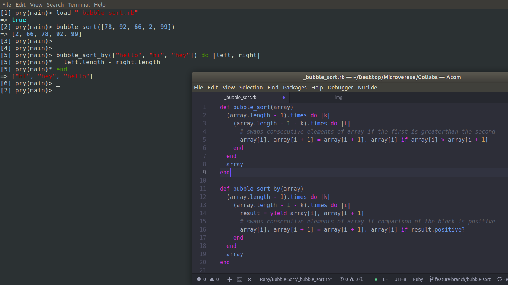

# Bubble Sort

> bubble_sort method that accepts an unsorted array and returns a sorted array.

> bubble_sort_by method that accepts an unsorted array and returns sorted array by sorting based on the comparison provided in a block using yield method.



## How to use this repo?

* Clone the repo
* Open the repo in terminal window
* Install ruby and pry 
* Open pry
* Run the following comand
```
load "_bubble_sort.rb"
```
* Call the methods with an array as parameter as shown in the example below
* Example
```
bubble_sort([4,3,78,2,0,2])

=> [0,2,2,3,4,78]

bubble_sort_by(["hi","hello","hey"]) do |left,right|
  left.length - right.length
  end

=> ["hi", "hey", "hello"]
```

## Live Demo

[Live Demo Link](https://repl.it/@binii/Bubblesort)

## Built With

- Ruby

## Authors

👤 **Binyam Hailemeskel**

- GitHub: [@bini-i](https://github.com/bini-i)
- Twitter: [@binyamshewa](https://twitter.com/binyamshewa)
- LinkedIn: [LinkedIn](https://www.linkedin.com/in/binyam-hailemeskel-728048151/)

👤 **Dibyendu Das**

- GitHub: [@DibDas](https://github.com/dibdas)
- Twitter: [@DIBYEND78120480](https://twitter.com/DIBYEND78120480)
- LinkedIn: [Dibyendu Das](https://www.linkedin.com/in/dibyendu-das-b5967a1b1/)

## 🤝 Contributing

Contributions, issues, and feature requests are welcome!

## Show your support

Give a ⭐️ if you like this project!

## Acknowledgments

- Ruby docmentation
- [Ruby Guides](https://www.rubyguides.com/)

## 📝 License

This project is [MIT](./LICENSE) licensed.
